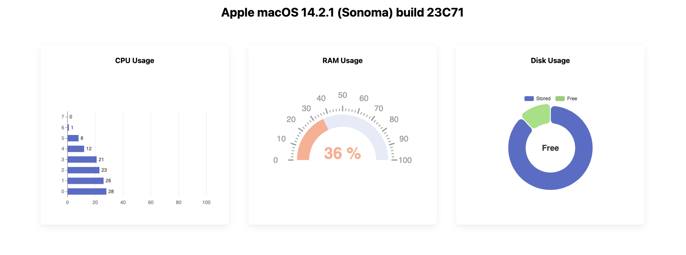

<h3 align = "center">

</h3>

# Quick start
## Docker
* `docker run -it -d --name node-scope  -p 8082:8082 --privileged superstep/node-scope`
* Access via 8082 port

[Demo](http://78.36.94.147:8082/)

<h3 align = "center">
    
</h3>

